### Hi there :octocat:

Welcome to my GitHub profile!

### My Apps

  <a href="https://github.com/jguddas/my-activity-dashboard#gh-light-mode-only">
    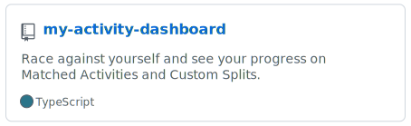
  </a>
  <a href="https://github.com/jguddas/my-activity-dashboard#gh-dark-mode-only">
    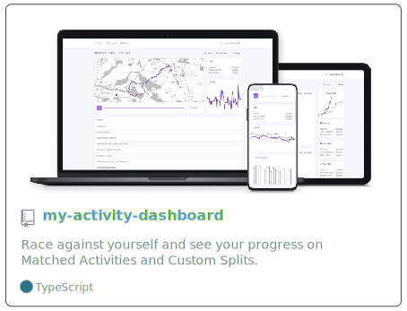
  </a>
  <a href="https://github.com/jguddas/sankey-playground#gh-light-mode-only">
    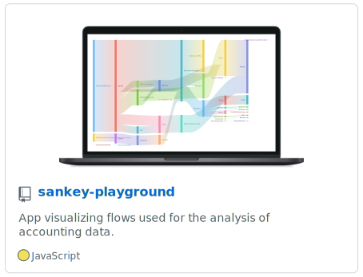
  </a>
  <a href="https://github.com/jguddas/sankey-playground#gh-dark-mode-only">
    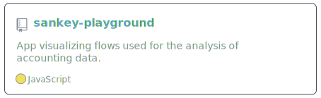
  </a>
  <a href="https://github.com/jguddas/next-ticker#gh-light-mode-only">
    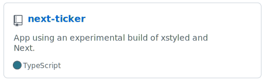
  </a>
  <a href="https://github.com/jguddas/next-ticker#gh-dark-mode-only">
    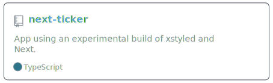
  </a>
  <a href="https://github.com/jguddas/my-route-planner#gh-light-mode-only">
    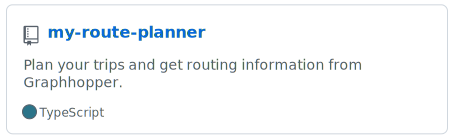
  </a>
  <a href="https://github.com/jguddas/my-route-planner#gh-dark-mode-only">
    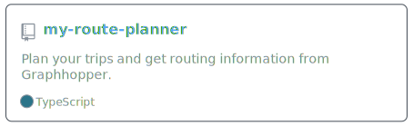
  </a>
  <a href="https://github.com/jguddas/quicktype-ts-blaze#gh-light-mode-only">
    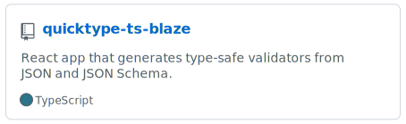
  </a>
  <a href="https://github.com/jguddas/quicktype-ts-blaze#gh-dark-mode-only">
    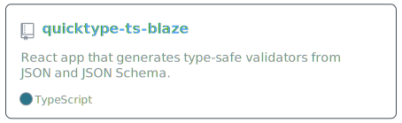
  </a>
  <a href="https://github.com/jguddas/quicktype-superstruct#gh-light-mode-only">
    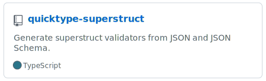
  </a>
  <a href="https://github.com/jguddas/quicktype-superstruct#gh-dark-mode-only">
    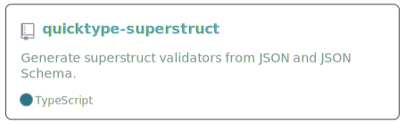
  </a>
  <a href="https://github.com/jguddas/drawn-hannover#gh-light-mode-only">
    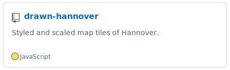
  </a>
  <a href="https://github.com/jguddas/drawn-hannover#gh-dark-mode-only">
    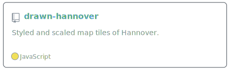
  </a>
  <a href="https://github.com/jguddas/menu-app#gh-light-mode-only">
    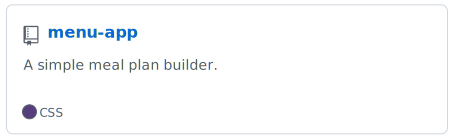
  </a>
  <a href="https://github.com/jguddas/menu-app#gh-dark-mode-only">
    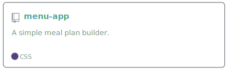
  </a>

